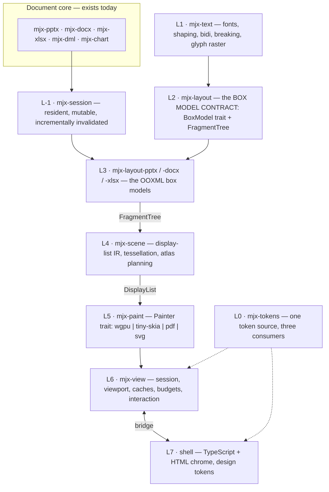

# The client platform — technical plan

> **Stage 1 of 3.** This document is the technical plan only. Stage 2 turns it into the execution
> loop; stage 3 builds the UI from the tickets that loop produces. Nothing here is code, and no code
> should be written against it until it has been read and argued with.
>
> Scope: a complete Office suite — view *and* edit — for PowerPoint, Word and Excel, rendered by a
> from-scratch engine, shipped as a Tauri application on every platform, with the browser as a later
> target that costs a build configuration rather than a second implementation.

---

## 0 · What already exists, and what it changes

The workspace is 377k lines of pure-Rust document model. That is not a starting point for a
renderer — it is most of the hard half already done, and the plan below is shaped around exactly what
it does and does not give us.

**What the renderer inherits for free.** `mjx-dml` already carries the guide-formula evaluator
(`geometry/formula.rs`), custom geometry resolved to `DrawCommand` paths, the full colour/theme
resolution chain, fill/outline/effects modelled both explicitly *and* effectively (style refs plus
placeholder inheritance), transforms with `effective_shape_bounds`, and the seven-tier text-property
ladder ending at the master's `p:txStyles`. A renderer does not re-derive any of that; it consumes
it. The core is also bytes-in/bytes-out with no filesystem, clock, threads or RNG — which is why the
same engine will run in a browser later without a porting effort.

**Four gaps sat directly on the critical path; one is now closed.** Each is verified in the tree,
not assumed, and a closed row keeps its evidence rather than being deleted — a plan that quietly
loses the problems it solved cannot be read back against the tree:

| # | Gap | Evidence | Consequence |
|---|---|---|---|
| 1 | ~~Preset shape **paths** are not generated~~ — **closed by MJXOFF-201 (Phase G)** | `crates/mjx-geometry/src/generated.rs` holds all 186 presets `presetShapeDefinitions.xml` defines geometry for, with their guides, text rectangles and connection sites; `PresetGeometryProvider` resolves them and MJXOFF-206 made it what a document renders with | Was: 187 preset shapes with adjustments and no geometry, deliberately deferred behind the `GeometryProvider` seam. `upArrow` is the one `ST_ShapeType` value the geometry file omits, and it is named by `PRESETS_WITHOUT_GEOMETRY` rather than silently missing. |
| 2 | The core **holds nothing between calls** | `crates/mjx-xlsx/docs/guide/large_workbooks.md`: *"A worksheet is cheap to hold and expensive to open, and this library holds nothing between calls… every call that reaches into a sheet's cells parses that sheet's part again."* | Correct for a batch library, fatal for an interactive editor. A **resident session** layer is required before any editing UI. |
| 3 | `p:timing` is **not modelled** | No animation model in `crates/mjx-pptx/src`; timing round-trips opaquely | Animations, transitions and "motion editing" are greenfield — model, runtime and editor. |
| 4 | No calculation engine, **by written policy** | `PLAN.md` records it as settled scope; `crates/mjx-xlsx/docs/guide/deliberate_limitations.md` says *"there will not be one"* | Now reversed (§9). Both documents must be amended in the same commit that opens the engine's epic, or the repo contradicts itself. |

`PLAN.md`'s Phase 7 line — *"Rendering (IR → text/layout → SVG → raster → PDF)"* — is also
superseded. SVG-first yields a picture you cannot hit-test, select into, or animate at 60 fps. The IR
targets a **display list**; SVG and PDF become exporters *from* that IR, not stages on the way to it.

---

## 1 · Decisions locked in this session

1. **Everything renders in Rust.** No JavaScript rendering library. `wgpu` is the graphics
   abstraction: Vulkan / Metal / DX12 natively, WebGL2 / WebGPU on `wasm32`. One pipeline, every
   platform.
2. **Tauri is the only shipping target for now**, on every platform it supports. The browser is a
   later *deployment* of the same crates.
3. **Rendering is a complete client-side package.** No backend is required and none may become
   load-bearing.
4. **Mobile owns a screen with a native surface** into which app integrations are brought — the
   document surface is primary, the chrome plugs into it.
5. **No ceiling on the product.** A complete suite, with gaps recorded rather than silently wrong.
6. **Non-document UI is TypeScript + HTML, driven by design tokens.** Only the document canvas is
   Rust-rendered.
7. **The box model is its own swappable layer**, defaulting to an OOXML implementation, so a
   different box model can be adopted and reuse the same surfaces.
8. **Plug-and-play boundaries** for data loading, view loading and surfaces, so the web target and
   any future source (network, collaboration, content store) is a configuration.
9. **A calculation engine is in scope** as its own programme (§9).
10. **Fonts are tiered**: system → bundled metric-compatible → lazily fetched subsets (§10).
11. **Geometry is behind a seam, and was not built first.** Preset shape paths depended on context
    the concurrent geometry workstream supplied, so the render pipeline was built *independently* of
    them: `mjx-scene` consumes a `GeometryProvider`, whose first implementation returned a
    placeholder shape. **The prediction held.** Phase G (MJXOFF-201) generated the table into
    `mjx-geometry` at rank 2.5 and MJXOFF-206 swapped the provider in; nothing downstream —
    tessellation, painting, hit-testing, the fidelity oracle — changed, and `mjx-scene` still cannot
    name the crate that resolves a preset, because 2.5 is above its 1.7. The stand-in stays as the
    honest answer for a shape there is genuinely no geometry to draw for, counted by
    `DrawReport::placeholders` so a golden image can never be taken against one.
12. **Application surface only.** Third-party, service and platform integrations — add-ins, cloud
    intelligence, tenant labelling, Power Query, automation runtimes, external publishing — are out
    of scope. They are enumerated as excluded in
    [`client-platform/OFFICE_FEATURE_INVENTORY.md`](client-platform/OFFICE_FEATURE_INVENTORY.md) §2
    rather than dropped silently, and they carry an `out-of-scope` ledger state.
13. **No window transparency.** Settled, not deferred: desktop composition uses non-overlapping
    regions (§6), so transparent-webview support and click-through hit-testing never arise.
14. **Theming follows [allr.work](https://allr.work)**, the product this platform is integrated into.
    Its tokens are read from source, not approximated; an editor's additions — a dark theme, a
    document-surface palette, contrast rules — are derived from them in
    [`client-platform/DESIGN_TOKENS.md`](client-platform/DESIGN_TOKENS.md).

### The companion documents

| Document | What it settles |
|---|---|
| [`client-platform/OFFICE_FEATURE_INVENTORY.md`](client-platform/OFFICE_FEATURE_INVENTORY.md) | The implementation surface, derived from Microsoft's published control identifiers and the ECMA-376 schemas — 11,869 in-scope commands and 3,404 declared elements |
| [`client-platform/DESIGN_TOKENS.md`](client-platform/DESIGN_TOKENS.md) | The Allr token system as measured, plus the dark theme, document palette and contrast rules an editor needs |
| [`client-platform/HTML_BOX_MODEL.md`](client-platform/HTML_BOX_MODEL.md) | Whether HTML can render in the canvas — yes, as a fourth `BoxModel`, staged |
| [`client-platform/BUILD_PLAN_LOOP_1.md`](client-platform/BUILD_PLAN_LOOP_1.md) | **What this loop builds:** the renderer for all three formats, and every UI element audited in isolation — with application integration deferred to loop 2 |
| [`client-platform/CANVAS_UI_INVENTORY.md`](client-platform/CANVAS_UI_INVENTORY.md) | The 61 in-canvas UI elements, and the standalone manual runtime harness that exercises them on desktop and mobile |
| [`client-platform/SESSION_AND_PERSISTENCE.md`](client-platform/SESSION_AND_PERSISTENCE.md) | The operation journal, coalescing, and time-batched commit — record immediately, apply immediately, serialise on a schedule |

---

## 2 · The shape of the thing

Eight layers. The rule that makes them worth having: **each layer's output is a complete, inspectable
value that the layer above consumes and nothing below it knows about.** That is what makes the box
model swappable, the painter replaceable, and every layer testable without a window.



Read the two horizontal cuts:

- **`FragmentTree` is the box-model seam.** Everything above it — scene building, painting, hit
  testing, selection, the whole interaction layer — is written against `FragmentTree` and has never
  heard of OOXML. Swap `mjx-layout-pptx` for a CSS box model, a Markdown box model, or a
  domain-specific one, and the surfaces below keep working unchanged.
- **`DisplayList` is the painter seam.** A `wgpu` painter draws it to a screen; a `tiny-skia` painter
  draws it to a pixel buffer for headless golden tests and print; a PDF and an SVG exporter write it
  out. None of them can see a font file or a layout algorithm.

---

## 3 · Two project rules this programme must amend

`CLAUDE.md`'s architecture rules are load-bearing and are not to be routed around. Two of them
genuinely cannot survive contact with a GPU, and the honest move is to amend them in writing rather
than let a crate quietly violate them.

**Amendment A — "pure-Rust only in shipped crates; no C/system libs."** You cannot put a pixel on a
screen without the operating system's graphics stack. `wgpu` links `ash` (the Vulkan loader),
`metal`/`objc2`, and `windows-rs`. The amendment is narrow and precise:

> The pure-Rust rule governs the **document graph** — every crate from rank 0 through the facade.
> Rank 5.5 (`mjx-paint`) is the declared platform boundary and may link the platform's graphics API.
> `mjx-scene` and everything below it stay pure Rust, so the headless, `wasm32`, export and test
> paths never require a GPU. `tiny-skia` — a pure-Rust software rasteriser — is a required second
> painter precisely so that a fully pure-Rust path to pixels always exists.

**Amendment B — `unsafe_code = "deny"`.** Creating a `wgpu` surface from a raw window handle is
`unsafe` by construction. `mjx-paint` becomes the fourth crate in the workspace with a local
`#[allow(unsafe_code)]`, and it carries the same kind of written justification the other three do:
*no hand-written unsafe beyond surface creation from a window handle supplied by the shell; the
handle's validity is the window system's invariant and is documented at each call site.* A CI grep,
matching the one already guarding `bindings/*/src`, holds that justification true.

A third consequence, not an amendment: `mjx-calc` (§9) and the render stack add crates to the rank
table, so `CLAUDE.md`'s table and `xtask/tests/layering.rs` both grow. They are the same table; a new
crate goes in both or CI fails.

---

## 4 · Layer specifications

### L0 · `mjx-tokens` — one token source, three consumers

A design token has to reach three places that share nothing: CSS for the HTML chrome, TypeScript for
the shell's logic, and **Rust for the in-canvas UI** — selection handles, alignment guides, rulers,
gridlines, marching ants, resize affordances. A canvas cannot inherit a CSS custom property, so a
token system that stops at CSS leaves the document surface visually detached from the app.

- **Source of truth**: one JSON file in W3C Design Tokens format.
- **Generated, committed outputs** (the project's existing codegen doctrine — `xtask`, never a
  `build.rs`): CSS custom properties, a TypeScript `Tokens` type plus defaults, and a Rust `Tokens`
  struct with a `const` default table.
- **Runtime resolution order**: explicit host configuration → CSS custom properties read off the host
  element → built-in defaults. The shell observes changes (`MutationObserver`,
  `prefers-color-scheme`) and pushes a resolved token snapshot across the bridge, so a theme change
  repaints the canvas in the same frame as the chrome.

### L-1 · `mjx-session` — the resident document

The core holds nothing between calls, and that is the single largest blocker to an editor. This layer
fixes it without touching the core's contract.

- **Residency**: a session owns a parsed, mutable document and keeps it. Part-level laziness and
  copy-on-write survive intact — an untouched part is still raw bytes, still re-emitted verbatim.
- **Edit journal**: every mutation is a typed command, appended to a journal. Undo/redo, and the
  invalidation source. Commands are the only way to mutate, so nothing can change without producing
  an invalidation.
- **Invalidation**: a command reports the addresses it dirtied (`part`, block path, cell range).
  Layout, scene and paint caches subscribe. This is what makes a keystroke reflow one paragraph
  rather than a document.
- **Batched commit**: operations are recorded and applied immediately, but the document is
  **serialised on a schedule**, not on every operation — coalescing turns twenty keystrokes into one
  part serialisation. The journal is flushed frequently and cheaply; the document is committed
  infrequently; recovery is the last commit plus the journal tail. Full policy, triggers and budgets
  in [`client-platform/SESSION_AND_PERSISTENCE.md`](client-platform/SESSION_AND_PERSISTENCE.md).

### L1 · `mjx-text` — typography

The layer that decides whether the product looks like Office or like an approximation. All pure Rust.

| Concern | Crate | Note |
|---|---|---|
| Font files, parsing, metrics | `ttf-parser` | variable fonts, colour tables (COLR/CPAL, sbix, CBDT) |
| Font database & fallback | `fontdb` + our substitution table | see §10 |
| Shaping | `rustybuzz` | a pure-Rust HarfBuzz port — behaviourally closest to what Office produces |
| Glyph rasterisation & scaling | `swash` | hinting, subpixel positioning |
| Bidirectional text | `unicode-bidi` | UAX #9 |
| Line breaking | `unicode-linebreak` | UAX #14 |
| Grapheme clusters | `unicode-segmentation` | already a workspace dependency |

Beyond wiring those together, this layer owns the parts nobody else can: script and font itemisation
of a run, the shaped-run cache keyed by `(font, size, features, text)`, a **glyph atlas** with
scale-bucketed rasterisation and quantised subpixel offsets, vertical text and East Asian layout
(`mjx-dml` already models `vert`), ruby/phonetic guides, kerning and OpenType feature selection from
the document's own properties, and hyphenation.

**Metric compatibility is a first-class requirement, not a nicety.** If a substituted font's advance
widths differ from the original's, every line breaks in a different place and pagination diverges
from Office on page one. §10 is how that is held.

### L2 · `mjx-layout` — the box model contract

**This is the layer the whole plan is organised around.** It defines a vocabulary and knows nothing
about OOXML.

```rust
/// A box model: anything that can turn a content source into positioned fragments.
pub trait BoxModel {
    type Content: ?Sized;
    type Error;

    /// Lay out one page/frame, resuming from a checkpoint rather than from the beginning.
    fn layout_page(
        &mut self,
        content: &Self::Content,
        page: PageIndex,
        constraints: &Constraints,
        resume: Option<&Checkpoint>,
    ) -> Result<PageFragments, Self::Error>;

    /// Cheap enough to run over a whole document; refined as real pages are laid out.
    fn estimate_extent(&self, content: &Self::Content) -> Extent;

    /// Which pages a change invalidates.
    fn invalidate(&mut self, change: &ChangeSet) -> DirtyPages;
}
```

**`FragmentTree` — the universal output.** `BoxFragment` (border-box rect, transform, clip,
decoration reference), `LineFragment` (baseline, ascent/descent, bidi runs), `GlyphRunFragment`
(font id, size, glyph ids with positions), `ImageFragment`, `ShapeFragment` (geometry reference),
`TableFragment`, plus — on every fragment — a `SourceRef` back to the document address that produced
it (`part`, path, character range). That back-link is what makes hit-testing, selection, caret
placement, comment anchoring and accessibility possible without the interaction layer knowing what a
`.docx` is.

**`Checkpoint` is the scrolling trick.** Word-style flow is sequentially dependent: page 300 depends
on page 299. Laying out page 300 from the beginning every time a user drags a scrollbar is
unaffordable. So each page boundary emits a small continuation token — the layout state at that
break — and page *N* is laid out from *N−1*'s checkpoint. Checkpoints are cheap enough to keep for
every page of a large document; page *fragments* are not, and live in a byte-budgeted LRU.

**Why the abstraction is trustworthy on day one:** it ships with **three** implementations
immediately (L3). An abstraction with one implementation is a guess; with three genuinely different
ones it is a contract.

### L3 · The OOXML box models

Three implementations, one vocabulary. This is where the person-years are.

**`mjx-layout-pptx` — absolute.** No reflow: shapes are placed by `a:xfrm`, resolved through
layout and master. Owns text-body layout inside a shape (insets, anchoring, columns, wrap),
autofit (`normAutofit`/`spAutoFit` — the font-scale search PowerPoint performs), group transforms
with child coordinate spaces, connector routing, table layout inside a graphic frame, chart plotting
(axes, scales, series geometry — plot-area layout is its own sub-engine), and SmartArt/diagram
layout.

> **Built in MJXOFF-169 (R14), part 1.** The crate exists at rank 3.6 and is the workspace's first
> implementation of `BoxModel`: slide geometry, the shape tree in z-order with group transforms
> composed, text-body layout, the nine bullet levels, tab-stop resolution and autofit. **Tables,
> connector routing, images, effects, charts and SmartArt are not in it yet** — R15 and R23. Nothing
> in it is parity with PowerPoint and it does not claim to be: every behaviour chosen rather than
> read is marked `GUESS:` at its site, and honouring a stored `normAutofit` scale is kept
> deliberately apart from *computing* one, which is running PowerPoint's own unspecified search.

**`mjx-layout-docx` — reflow. The hardest engine in the project.** Line breaking and justification
(including East Asian rules), pagination with widow/orphan/keep-with-next/keep-lines, sections and
column balancing, tables that split across pages with repeating header rows, nested tables, and
row/column spans, **floating objects and text wrapping** (`square`/`tight`/`through`/`topAndBottom`
with real wrap polygons — the single most under-estimated feature in Word rendering), headers and
footers with first/even/odd variants, footnotes and endnotes with their own reflow, drop caps, text
frames, tab stop resolution, numbering and list restarts, fields, revision marks affecting layout,
and OMML mathematical layout (its own typesetter, closer to TeX than to prose).

**`mjx-layout-xlsx` — grid.** Row/column geometry with hidden and auto-fit sizing, merged regions,
the **number-format engine** (`numFmt` → display string, locale-aware, both 1900 and 1904 date
systems, conditional format sections, fraction and scientific forms — a sub-project in its own
right), text overflow into empty neighbours and the clipping rules that govern it, wrap and shrink-to-
fit, frozen and split panes, conditional formatting *evaluation* including data bars, colour scales
and icon sets, cell borders with their resolution precedence, drawings anchored to cells (one-cell,
two-cell, absolute), sparklines, autofilter and table styling, and print layout — page breaks, print
areas, scaling, repeated titles.

### L4 · `mjx-scene` — the display list

`FragmentTree` in, a flat binary display list out.

- **Commands**: `PushTransform` / `PushClip(rect | path)` / `PushOpacity` / `PushEffect` / `Pop`,
  `FillPath`, `StrokePath`, `DrawGlyphs`, `DrawImage`.
- **Paints**: solid; linear, radial and path gradients with DrawingML's full stop and tile
  semantics; the 54 preset patterns; blip fills with tile/stretch/crop; and the image adjustments
  DrawingML defines (duotone, colour change, alpha modulation, luminance).
- **Effects**: `outerShdw`, `innerShdw`, `glow`, `softEdge`, `reflection`, `blur`, and the effect DAG.
  Implemented as offscreen subtree renders plus shader passes, drawing from a budgeted texture pool.
- **Tessellation in Rust, with `lyon`.** Paths become triangles here, not in the painter. That is
  deterministic across platforms, testable without a GPU, and shared by every painter and exporter.
  Tessellation is resolution-dependent, so geometry is tessellated per **scale bucket** and cached.
- **`GeometryProvider` — the seam that lets this be built first.** Shape geometry enters the scene
  builder through one trait: `fn outline(&self, shape: &ShapeRef, size: Extent) -> Result<Paths>`.
  The first implementation returns a **placeholder** — a labelled rounded rectangle at the shape's
  resolved bounds — so tessellation, painting, effects, hit-testing, export and the whole budget
  regime are exercised and gated long before the preset-path table exists. The generated table
  becomes a second implementation and changes nothing above it. This is decision 11, and it is what
  makes the render pipeline independent of the concurrent geometry workstream.
- **Encoding**: a flat, versioned, typed-record arena — readable without deserialisation, cacheable
  to disk, and diffable frame to frame so a repaint can upload only what changed.

### L5 · `mjx-paint` — painters and surfaces

```rust
pub trait Painter {
    fn begin(&mut self, target: &SurfaceTarget, viewport: Viewport) -> Result<Frame, PaintError>;
    fn draw(&mut self, frame: &mut Frame, list: &DisplayList, resources: &ResourceTable) -> Result<(), PaintError>;
    fn end(&mut self, frame: Frame) -> Result<(), PaintError>;
}
```

Four implementations, all required:

| Painter | Backend | Purpose |
|---|---|---|
| `WgpuPainter` | Vulkan / Metal / DX12 / WebGL2 / WebGPU | the product |
| `SkiaPainter` | `tiny-skia`, software, pure Rust | headless golden tests, print rasterisation, GPU-loss fallback, old Android WebView |
| `PdfExporter` | vector | export and print |
| `SvgExporter` | vector | export, and a debugging view of the display list |

**The WebGL2 constraint decides the pipeline.** `wgpu`'s WebGL2 backend has no compute shaders, so a
compute-driven vector renderer (Vello) cannot be the design if the browser is ever a target. A
tessellation pipeline with MSAA runs on every backend from WebGL2 to Vulkan. That is the whole reason
tessellation lives in L4 rather than in the painter.

### L6 · `mjx-view` — session, viewport, budgets

The layer that makes a 400-page document behave. **This — not hosting — is what "high-throughput page
view memory management" actually means.** A 400-page document at 150 dpi is ~4 GB of pixels; nobody
holds that anywhere, client or server.

- **Viewport windowing**: fragments and display lists are materialised for visible pages plus a small
  prefetch ring, in scroll direction.
- **Byte-budgeted LRU caches**, one per stage (checkpoints, fragments, display lists, tessellations,
  glyph atlas, image decodes, effect textures), each with an explicit ceiling. The workspace already
  owns `mjx-allocation-counter`, and it is what turns these ceilings into asserted tests rather than
  claims.
- **Scroll stability**: `estimate_extent` gives a scrollbar on open; real page heights replace
  estimates as pages are laid out, without the scrollbar jumping under the user's thumb.
- **Frame scheduling**: input at the display's refresh rate, layout off the input path, progressive
  refinement (a fast preview tier during a fling, full fidelity on settle).
- **Interaction**: hit-testing against a per-page spatial index built during layout, selection models,
  and the command dispatch back down to `mjx-session`.

#### What MJXOFF-168 (R13) built, and the four things worth knowing before reading it

The crate exists at rank 3.8, and all of the above is there except the last bullet — **interaction is
loop 2 and deliberately absent**, because this unit schedules and caches and does not respond to
input. The spatial index a hit test will query is built during layout and is held here, which is the
whole of what this unit owes that one.

1. **The seven stages are a table, and three of them are this crate's.** `CacheBudget` carries a
   declared ceiling for all seven, because a table with three rows would quietly redefine the
   problem; `Stage::is_held_by_the_viewport` says which three the viewport measures, and the module
   documentation names the crate that owns each of the other four — tessellations are `mjx-scene`'s
   `MeshCache`, and the atlas, image and effect pools are the painter's. A viewport that constructed
   them would be a viewport that had to know what a device is.
2. **Checkpoints are kept for every page; fragments are not.** A `Checkpoint` is bounded at 1 KiB, so
   four hundred of them is 400 KiB and keeping all of them turns *"scroll to page 300"* into one page
   of layout. That asymmetry is why the checkpoint stage's ceiling is a **reported** bound rather
   than an evicting budget.
3. **The scroll state is an anchor, never an offset.** A `ScrollAnchor` is a page and how far into
   it, which is what a reader means by "where I am"; a document offset means the same thing only
   while the pages before it keep the heights they were guessed at. Correct a height and the extent
   changes, the pages after it move, and the anchor's screen position does not.
   `tests/scroll_stability.rs` asserts all three at once, because the third alone is an identity.
4. **The frame budget is checked *between* tasks and never before the first.** A frame that found
   its budget already spent and ran nothing would never run anything again; so a single page costing
   more than a whole frame still runs, and the frame reports the overrun rather than dropping the
   page. The overshoot is bounded by one task, and that is what the gate asserts.
5. **A viewport has no refusal of its own, and an over-long estimate is not an error.** *No such
   page* and *past the end of the content* are questions only a box model can answer, so
   `ViewFailure` carries the box model's error and the scene source's and has no third variant. A
   window built from an estimate can name a page that does not exist — including one this very
   frame has just discovered is past the end — and the frame **skips** it and counts it in
   `FrameReport::pages_past_the_end`. The reverse case is handled too: an insertion makes the
   document's length a guess again, so a reflow clears the end marker and the *next* frame asks
   `estimate_extent` how long the document is now. Without that, a scrollbar that had reached the
   end of a document would clamp short of content the edit added.

Two figures are worth carrying forward. The resident-memory gate walks a four-hundred-page document
twice — once under a real budget and once with eviction disabled — and the second peaks **7.5× higher
and over the ceiling**, which is what makes the first a measurement rather than a green. And
`mjx-session`'s worksheet residency, which MJXOFF-167 shipped unbounded and said so, is now bounded
by bytes, with dirty sheets pinned so an edit can never be evicted.

### L7 · The shell — TypeScript, HTML, tokens

Everything that is not the document canvas: ribbon and toolbars, panels and inspectors, dialogs, file
browser, navigation, comments, status bar, settings.

- **Framework-free Web Components** (custom elements + Shadow DOM), so the shell embeds into a host
  app of any stack. Theming through CSS custom properties and `::part()`.
- **Responsive by container query, never device sniffing.** Three chrome modes — desktop
  (ribbon + docked panels), tablet (compact toolbar + sheets), phone (contextual toolbar + bottom
  sheets) — over one document surface.
- **In-canvas UI stays in Rust.** Selection handles, rotation affordances, alignment and snap guides,
  marching ants, drag previews, the text caret, cell-range handles. Round-tripping those through the
  webview at 60 fps is exactly the latency mistake this architecture exists to avoid. They read the
  same design tokens (L0), so they match the chrome.

---

## 5 · The three plug-and-play boundaries

Because rendering is always client-side Rust, the pluggable seams are not *where code runs* — they
are where bytes come from, where pixels go, and how the chrome talks to the engine.

**1 · `DocumentSource` — where bytes come from.**

```rust
pub trait DocumentSource {
    fn open(&self, id: &DocumentId) -> BoxFuture<Result<DocumentBytes, SourceError>>;
    fn save(&self, id: &DocumentId, bytes: &[u8]) -> BoxFuture<Result<(), SourceError>>;
    fn capabilities(&self) -> SourceCapabilities;   // random access? writable? watchable?
}
```
Implementations: local filesystem (Tauri), in-memory, HTTP with range requests (a browser opening a
large package without downloading all of it), and later a collaboration or content-store source.

**2 · `SurfaceHost` — where pixels go.**

```rust
pub trait SurfaceHost {
    fn raw_handle(&self) -> SurfaceHandle;      // window handle, or an HTML canvas
    fn size(&self) -> PhysicalSize;
    fn scale_factor(&self) -> f64;
    fn request_redraw(&self);
}
```
Implementations: a Tauri desktop window region, the **mobile native surface** (§6), an HTML canvas on
`wasm32`, and an offscreen target for tests, thumbnails and export.

**3 · `ShellBridge` — how the chrome talks to the engine.** A versioned command/event protocol, not
an ad-hoc set of Tauri commands. Commands (open, edit, format, navigate, select) and events
(selection changed, document dirtied, layout progressed, error). Two transports behind one interface:
Tauri IPC today, direct `wasm-bindgen` calls in the browser later. **Bulk data never crosses as
JSON** — display lists and any large payload move as binary buffers.

---

## 6 · Platform matrix

The composition problem is the one that decides the shell's shape, so it is settled here rather than
discovered later.

**Desktop — region composition, not overlay.** The window is partitioned into non-overlapping
regions: webview regions for chrome, a `wgpu` surface region for the document. Partitioning is chosen
over a transparent webview floating above the surface because transparency support is uneven across
WebView2 / WKWebView / WebKitGTK, and because click-through hit-testing against a transparent webview
is a per-platform hack. Anything that must float *above* the document — context menus, floating
toolbars, selection UI — is drawn by the Rust renderer, which is where it belongs for latency anyway.
A region layout manager in Rust assigns the rectangles and keeps them in step during resize.

**Mobile — the native surface, as specified.** Tauri on iOS and Android is a single webview and
**does not support multiple windows**. So the app owns a screen: a native render surface (Android
`SurfaceView`, iOS `CAMetalLayer`) provided by a small **Tauri plugin** we write
(`tauri-plugin-mjx-surface`), with the webview chrome composited around and over it by the platform's
own view hierarchy. This is precisely the "own a screen with a placeholder surface that app
integrations plug into" model. Dialogs become sheets in the webview; there is no second window to
have.

**Browser (later) — the same crates, a different host.** The engine compiles to `wasm32`; `wgpu`
targets WebGL2 with WebGPU used opportunistically where present. `SurfaceHost` is an HTML canvas,
`DocumentSource` is HTTP or the File System Access API, `ShellBridge` becomes direct calls. Known
ceilings to design within: `wasm32` linear memory caps at 4 GiB (realistically ~2 GiB before
allocator failure on Safari), and threads require COOP/COEP headers that conflict with third-party
embedding — so the engine must remain correct, if slower, single-threaded.

**Dialogs.** Declared once as a `Surface` (`Modal | Sheet | Popover | Panel | DetachedWindow`) and
presented by a per-platform presenter — a real window on desktop, a sheet on mobile, a portal in a
browser embed. Operating-system dialogs (file open/save, colour picker, print) belong to the
third-party/platform surface that is out of scope for now; the application supplies its own until
that changes, which also keeps every platform's behaviour identical while the engine is being built.

---

## 7 · Crate ranks

`CLAUDE.md`'s rank table and `xtask/tests/layering.rs` are the same table and both grow. New rows:

| Rank | Crate | Depends on | Role |
|---|---|---|---|
| 0.2 | `mjx-tokens` | — | token types + generated defaults |
| 1.5 | `mjx-text` | core, tokens | fonts, shaping, bidi, breaking, glyph raster |
| 1.6 | `mjx-layout` | core, `mjx-text` | **the box model contract**: `BoxModel`, `FragmentTree` |
| 2.3 | `mjx-calc` | `mjx-sml` | the calculation engine (§9) |
| 1.7 | `mjx-scene` | `mjx-layout` | display-list IR, `lyon` tessellation, atlas planning |
| 3.5 | `mjx-session` | the three format crates | resident document, edit journal, invalidation |
| 3.6 | `mjx-layout-pptx` / `-docx` / `-xlsx` | format crate + `mjx-layout` | the OOXML box models |
| 3.6 | `mjx-layout-html` | `mjx-layout`, `html5ever`, `taffy` | the HTML box model — `w:altChunk`, clipboard paste, and the proof the contract is not OOXML-shaped ([HTML_BOX_MODEL.md](client-platform/HTML_BOX_MODEL.md)) |
| 3.8 | `mjx-view` | `mjx-session` (no default features), `mjx-scene`, `mjx-layout` | viewport, caches, budgets |
| 4.0 | `mjx-ooxml` | + `mjx-view`, `mjx-paint` behind a non-default `render` feature | unchanged role |
| 5.5 | `mjx-paint` | `mjx-scene` | **the platform boundary** — `wgpu`, `tiny-skia`, exporters |
| 6.0 | `apps/mjx-studio` | the facade with `render` | the Tauri application |

**`mjx-scene` is at 1.7 and not at 2.6.** This table said 2.6 until MJXOFF-161, and that was a
defect rather than a preference. The layering gate refuses an edge only when it points *up or
sideways*, so a `mjx-scene` above `mjx-dml` (2.0) makes `mjx-scene → mjx-dml` a legal **downward**
edge — and the guarantee the display list exists to hold, that below it nothing has heard of a font,
a layout algorithm or a document, would then be enforced by nothing at all. `mjx-layout` was put at
1.6 for exactly this reason and the second seam gets the same treatment. Everything `mjx-scene`
depends on sits below 1.7, and nothing below 2.0 will ever depend on it, so the rank costs nothing
and buys the rule.

Two more deliberate choices in that table. **`mjx-paint` sits at 5.5, above the facade**, because it is the
only crate that links the platform's graphics stack; putting it there keeps every graphics dependency
out of the document graph and out of the Python binding, which must never grow a GPU dependency.
And **`mjx-view` is re-exported through `mjx-ooxml` behind a non-default `render` feature**, so the
project's standing rule holds unchanged: nothing downstream — including a future web binding — ever
names a crate below the facade.

`mjx-calc` at 2.3 is what makes `mjx-xlsx (3.0) → mjx-calc (2.3) → mjx-sml (2.1)` a chain of legal
downward edges, the same reasoning that put SpreadsheetML's markup below the format tier in the first
place.

---

## 8 · Interaction and editing

Built on `FragmentTree`, so it is box-model-agnostic by construction.

- **Hit testing** against a per-page spatial index built during layout; a hit resolves to a
  `SourceRef`, which is a document address.
- **Three selection models.** Text: a bidi-aware caret with grapheme-cluster granularity, visual and
  logical movement, word and paragraph expansion, multi-range selection. Object: handles, rotation,
  proportional and free resize, snapping with alignment guides, z-order, grouping. Cell: ranges,
  whole rows and columns, multi-range, fill handle.
- **Input parity across every device class.** Mouse, trackpad (momentum scroll and pinch), touch
  (pan, pinch, long-press, two-finger), pen (pressure, tilt, palm rejection), and keyboard — the full
  shortcut map plus **IME**, which needs real composition support with an inline candidate window
  positioned from the caret's fragment, not an afterthought.
- **Editing flows one way**: a gesture becomes a command, the command mutates `mjx-session`, the
  session emits an invalidation, layout reflows the dirty pages, the scene rebuilds, the painter
  repaints. There is no other mutation path, which is what keeps undo, autosave, collaboration and
  accessibility honest.
- **Clipboard interop** in both directions: internal fidelity format, plus HTML, RTF, plain text and
  image — because pasting from and into real Office is a parity requirement.
- **Accessibility** is a layer output, not a retrofit: an accessibility tree derived from
  `FragmentTree` and its `SourceRef`s, exposed through the platform's API and through the webview
  chrome's ARIA.
- **Animations and motion editing** (`p:timing`) are greenfield in all three parts: a typed model in
  `mjx-pptx`, a runtime that evaluates the timeline into per-frame property deltas fed to the scene
  builder, and a timeline editor in the shell. Slide transitions are the same machinery.

---

## 9 · The calculation engine — a programme of its own

Now in scope, reversing written policy. `PLAN.md` and
`crates/mjx-xlsx/docs/guide/deliberate_limitations.md` must be amended in the commit that opens this
epic; leaving *"there will not be one"* in a shipped guide while building one is exactly the kind of
quiet contradiction this project's documentation discipline exists to prevent.

Scope, honestly stated: a dependency graph over cells and ranges with cycle detection and iterative
calculation; dirty propagation and minimal recalculation; ~500 built-in functions across every
category; array formulas and modern dynamic arrays with spill ranges; volatile functions;
cross-sheet and cross-workbook references; defined names; structured table references; the full error
value lattice and its propagation; and Excel's own numeric quirks — 15-significant-digit display,
1900 leap-year bug, both date systems — because "compatible with Office" means bug-compatible.

Sequencing note: the engine is only needed for *editing* Excel. Rendering an unedited workbook uses
the cached `<v>` values already in the file, so the engine does not block the Excel viewer and can be
built in parallel with it.

---

## 10 · Fonts

Three tiers, resolved in order:

1. **System fonts**, enumerated by `fontdb`. Available on desktop and Android. **Not on iOS** — the
   sandbox does not expose system font files, and reaching them would require CoreText FFI, which
   breaks the pure-Rust rule. iOS therefore relies on tier 2, which is one more reason tier 2 must be
   good.
2. **Bundled metric-compatible substitutes** — Carlito for Calibri, Caladea for Cambria, Liberation
   Sans/Serif/Mono for Arial/Times New Roman/Courier New. Metric compatibility is the point: matching
   advance widths mean matching line breaks, and matching line breaks mean pagination that agrees
   with Office on page 300, not just page 1.
3. **Lazily fetched subsets** for scripts we cannot afford to bundle — CJK, Indic, Arabic, and the
   long tail — served as subsetted Noto by script, cached locally after first use. Full CJK coverage
   is 100 MB+ and cannot ship in an app bundle for every platform.

Underneath all three: a **font substitution table** consulted before falling back blindly, embedded
fonts read from the package itself (PowerPoint and Word can both embed), and a per-document manifest
recording which substitutions were made — surfaced in the UI, because a user is entitled to know that
what they are seeing is not what the author sent.

---

## 11 · The fidelity oracle

For a rendering engine claiming parity, this is the single most important instrument in the project,
and it is a **foundational ticket, not a later one**. Building the engine for a year and *then*
asking how close it is would be the defining mistake available here.

- **The reference is PowerPoint itself, not LibreOffice.** LibreOffice is installed and is a useful
  *change detector* — it catches "this used to render and now doesn't", headlessly, in CI — but it is
  not ground truth and must never be described as parity. Parity is judged against real Office, on
  Windows, in a human-run offline pass that produces committed artefacts. (Office licensing generally
  forbids datacentre use, so this is not a CI job, and that is simpler.)
- **Baselines carry provenance and an authority flag.** One approved against a non-authoritative
  reference is **provisional** and must be re-adjudicated when the authoritative one arrives.
  Silently keeping LibreOffice-approved baselines would *ratify its rendering quirks into the ledger*
  — worse than having no reference at all, because it looks like parity.
- **"Pixel perfect" is only coherent through PDF.** Our screen render can never be pixel-identical to
  PowerPoint's — different rasterisers, hinting and antialiasing differ even when layout is exactly
  right. So both sides export to PDF, and the comparison has two tiers: a **layout tier**
  (`pdftotext -bbox-layout` gives word bounding boxes — exact, rasteriser-independent, and it names
  the word that moved) and a **pixel tier** (`pdftoppm` rasterises *both* PDFs with *one* rasteriser,
  so a remaining difference is a real one). PowerPoint's PDF export carries its own layout decisions —
  glyph positions, line breaks, autofit scale — which is precisely the ground truth wanted. It is
  still a proxy for its screen rendering, and saying so is what keeps the ledger honest.
- **Plan the Windows pass once, for both programmes.** The concurrent epic records its
  Office-authored fixture corpus as empty and unowned — "the programme's deepest weakness; nothing
  here has ever read a file real Microsoft Office wrote". One session authors fixture *files* for
  that and exports reference *PDFs* for this.
- **Perceptual diffing** with a structural metric and a per-fixture tolerance, not a byte compare.
  Every fixture carries a committed baseline; a regression fails CI with the diff image attached.
- **The `SkiaPainter` is what makes this affordable** — golden images render headlessly, in CI, with
  no GPU and no window.
- **Layered assertions**, so a failure localises: `FragmentTree` snapshots catch layout regressions
  without rendering at all; display-list snapshots catch scene-building regressions; only pixel
  diffs need a painter. A broken line-break shows up as a fragment diff, not as a mysterious image.
- **The parity ledger** (§13) is generated from these suites, so the claim "we support X" is
  produced by tests rather than by a person's memory.

### 11.1 · What MJXOFF-165 built, and the shape other children read

`mjx-render-oracle` is the crate. Test-only, `publish = false`, outside the rank graph and above the
whole document graph; **no crate with a rank may reach it in either dependency section**, and one
that is itself above the graph may. `docs/validation/08-the-fidelity-oracle.md` is the page addressed
to the person who has to look at the pictures.

**The trap it is written against, since every bullet above is silent about it.** *A golden image
generated by the code under test always matches the code under test.* Three refusals answer it:
a baseline with **no approval record fails**; regeneration takes a `RegenerationIntent` whose only
constructor reads `MJX_ORACLE_REGENERATE`; and regeneration **removes the approval it overwrites**
before writing anything. An approval binds a SHA-256 per artefact rather than a file name, so
`sha256sum` audits it and a silent rewrite is caught. Every baseline shipped today is stamped
`Approver::Generator` — a real record, **not a human review** — and the set is listable.

**The plate manifest is a published contract, and R11 and U01 both read it.** One JSON file,
`plates.json`, beside one PNG per plate:

| Level | Fields |
|---|---|
| document | `version`, `generator`, `premultiplied`, `provider`, `authoritative`, `parityClaimed`, `plates`, `documents` |
| plate | `name`, `description`, `file`, `width`, `height`, `sha256`, `content`, `provider`, `excluded`, `placeholders`, `drawCalls`, `covered`, `approver`, `reviewed`, `parity`, `referenceFile`, `diffFile`, `difference` |
| document row | `fixture`, `format`, `verdict`, `reason` |

`referenceFile`, `diffFile` and `difference` are present **only** when a plate stops matching its
approved baseline; a diff under every green plate is one a reader learns to scroll past.

**Two numbers this section did not anticipate, both measured rather than reasoned.**

* **`Pixels` is premultiplied and stays premultiplied**; a PNG sample is not, so the conversion
  happens once at the file boundary. A plate written premultiplied renders wrong in every browser.
* **A per-fixture tolerance stated as a fraction of the page cannot see a local defect.** A word
  displaced eight points is 0.85 % of a page and moves the mean SSIM from 1.00 to 0.98 — inside a
  cross-producer tolerance. The minimum SSIM over 8×8 windows has no denominator, and it is what
  makes the pixel tier local enough to be worth running.

### 11.2 · What MJXOFF-166 (R11) built, and why it is a harness rather than a plate set

`mjx-canvas-harness` is the crate. Test-only, `publish = false`, outside the rank graph and above
the whole document graph beside `mjx-reference-pack`; **nothing may depend on it in either
dependency section.** `docs/client-platform/CANVAS_UI_INVENTORY.md` §2 is the specification — sixty-
one things the Rust renderer draws that are not document content — and
`docs/client-platform/CANVAS_UI_AUDIT.md` is the checklist a person picks up.

**The trap it is written against, and it is not the oracle's.** *A plate proves appearance and
nothing else.* The earlier proposal in this document — render each element to a PNG and publish the
plates into Storybook — would have settled how a resize handle *looks* and said nothing about
whether it can be grabbed, how far past its own edge the grab reaches, or whether a thumb can hit
it. A handle you cannot drag says nothing about its grab tolerance; a touch target is only real on a
touch device. So the crate ships **both roles and keeps them apart**:

| Instrument | Role | Driven by |
|---|---|---|
| the harness (`serve`) | the audit surface — manual, interactive, exhaustive | a person |
| the plates (`check`) | regression only — appearance locked once approved | CI, headless `tiny-skia` |

**Every pixel of the element is drawn in Rust** — a hand-built `mjx-layout` fragment tree, through
`mjx-scene`'s display list, through `mjx-paint`'s software painter — and the browser is the *chrome*,
which is this document's own division and the user's standing constraint. The page carries no
`<canvas>`, no SVG generation and no plotting library; the element under audit is an `` whose
bytes came out of the painter, and so are the ruler, the hit-test overlay and the page it sits on.
The pixel inspector is an **endpoint** rather than two lines of `getImageData`, because a second
reading of the image would be a second answer to *"what colour is this"*.

**It is a local HTTP server rather than a native window, and that is a decision with a reason.**
Eleven of the sixty-one entries are about touch, the user's own audit rule asks for every element in
isolation *at both mobile and desktop sizes*, and a desktop window cannot be opened on a phone.
`serve --host 0.0.0.0` plus the machine's address on the same network puts the harness under a real
thumb at a real density. **This is not the `tauri-plugin-mjx-surface` MJXOFF-166 specifies, and it
does not pretend to be**; `CANVAS_UI_INVENTORY.md` §4.2 says exactly what is missing, and corrects
the ticket's premise while it is there — R08 already generalised `SurfaceHost` over a platform window
handle, so what is missing is a *shell* on a phone, not a rendering seam.

**Four gates, each written against a specific way of passing while proving nothing.**

1. *"All 61 elements have a scene"* is satisfied by sixty-one titled empty canvases. Five counters
   per entry — placeholders, draw calls, covered pixels, **distinct colours**, and the declared
   command kinds — plus a command count strictly above the bare stage's. The distinct-colour counter
   is R10's own hand-off: an overlay drawn in the page's own ink passes every other check and is
   invisible.
2. *A state toggle that does nothing is invisible to any reachability check.* Every entry declares
   which axes of the matrix move its pixels, and the suite measures the declaration **in both
   directions**. It found six disagreements on its first run — which is also its own weakness, and
   `Entry::responds` says so: a declaration written *from* a measurement cannot detect that the
   measurement was wrong to begin with.
3. *A hit-test visualiser that computes its own regions proves nothing about the index.* A grab
   region records a **fragment**, not a rectangle; the drawn rectangle is `SpatialIndex::bounds_of`
   inflated by the input device's padding. There is nowhere for a second computation to live.
4. *A golden image generated by the code under test always matches the code under test.* Answered by
   not answering it here at all: the baselines, the approval events and the explicit-only
   regeneration path are `mjx_render_oracle::baseline`'s, unchanged. This is the **first** consumer
   of that crate's plate generator — `mjx-reference-pack` uses its authority vocabulary and never
   renders a plate — so the permitted half of the layering rule was asserted and unexercised until
   R11.

**⚠ Every plate is stamped `approver = generator`, and nobody has looked at these images.** That is
a real approval record — the digest binding is live, so a silent regeneration is caught — and it is
not a human review. `serve`, `list`, `check`, the gallery, the checklist and the CI job all say so;
audit pass 10 added the last two of those, because `check` is the command CI runs and the page is
the surface the review happens on, and both were quiet.

**The live token editor writes back** to `docs/client-platform/data/tokens.json`, editing the
narrowest possible span so a one-character tweak is a one-line diff rather than a reformat of the one
hand-edited artefact in the pipeline. Audit pass 10 moved `DESIGN_TOKENS.md` §2.2's contrast rule
down into `mjx-tokens` so the editor can refuse a bad text colour at the keystroke, which is where
that failure belongs; before that it lived in `xtask` alone, the harness could not call it, and the
refusal arrived a build later.

**Two seams that a rank cannot hold, and now do not have to.** This crate and `mjx-render-oracle`
have no rank, so `xtask/tests/layering.rs` holds nothing about what either depends on. Each carries
its own `tests/the_seam_holds.rs` asserting its dependency set exactly: the harness names **no**
format crate, facade, packaging tier or shared markup — the geometry table included — which is what
makes *"the harness needs no document and no fixture"* true and lets in-canvas design be settled
while the format renderers are still being built; the oracle names DrawingML for one specimen and no
file format at all. See `CLAUDE.md` before adding a dependency to either.

---

## 12 · Performance budgets

Written down now, asserted by tests, because a budget discovered late is a rewrite. `mjx-allocation-
counter` already exists and is what turns each of these into a gate.

| Budget | Target | Held by |
|---|---|---|
| Open to first page painted | < 500 ms for a 50-page document | streaming open + `estimate_extent` |
| Frame time, pan and zoom | 16.6 ms at 60 Hz, 8.3 ms at 120 Hz | display-list diffing, atlas reuse |
| Keystroke to repaint | < 30 ms | invalidation reflows one paragraph, not a document |
| Resident memory, 400-page document | < 400 MB desktop, < 200 MB mobile | byte-budgeted LRUs |
| GPU texture budget | < 256 MB desktop, < 96 MB mobile | atlas and effect-pool eviction |
| Cold start, mobile | < 2 s to interactive | lazy font tiers, deferred subsystem init |

---

## 13 · The parity ledger

"No holes" is only meaningful if holes are *countable*. The ledger is a generated, tracked matrix —
every Office capability, per format, with a state: `implemented` / `partial` / `preserved-not-
rendered` / `not-started`. It is generated from the test suites of §11, lives in the tracker as the
programme's spine, and its states are produced by evidence rather than assertion.

The honest framing, stated once: LibreOffice is roughly 10M lines and is not at parity with Office.
Full parity — Word's reflow with floating-object wrapping and page-splitting tables, Excel's number
format *and* calculation engines, PowerPoint's animation runtime, plus editing, IME, accessibility,
clipboard interop and track changes across three formats — is a many-tens-of-person-years programme.
That is not an argument to scope down; it is the argument for the ledger. The project already does
this well in `deliberate_limitations.md`, and this generalises that discipline to the whole product:
**a gap is recorded, never silently wrong.**

---

## 14 · Dependency-ordered phases

Ordered by what cannot be built without what — not by what would ship soonest. Editing requires
selection; selection requires hit-testing; hit-testing requires a fragment tree; a fragment tree
requires layout. That chain, not a release date, is what fixes the order.

> **Loop structure.** The phases below are the programme. The *current* loop takes a deliberate cut
> across them: **the renderer for all three formats, plus every UI element in Storybook for design
> audit, with no application integration.** Chrome is validated in isolation before anything is wired
> to anything. See [`client-platform/BUILD_PLAN_LOOP_1.md`](client-platform/BUILD_PLAN_LOOP_1.md) for
> that cut and its unit-level gates — including the catch that in-canvas UI (handles, guides, caret,
> marching ants) cannot be a web component, and therefore needs an audit surface of its own.
> **That surface is the canvas harness of §11.2, not a set of image plates.** This sentence used to
> say *"and is audited as generated image plates instead"*, which was the earlier proposal and was
> superseded by R11: a plate proves *appearance* and nothing else, and almost everything on that
> surface is only correct in motion and under the pointer. The plates still exist and are demoted to
> what they are good at — regression, once a design has been approved.

**Phase R0 — Foundations, built independently of geometry.** `mjx-tokens` and its codegen, seeded
from the Allr token source. `mjx-text` through to shaped, rasterised glyphs. `mjx-layout`'s contract
with its first consumer. `mjx-scene` and `lyon` tessellation, consuming a **`GeometryProvider` whose
first implementation returns a placeholder shape** (decision 11) — so the whole pipeline is exercised
end to end without waiting on the preset-path table. `mjx-paint` with both the `wgpu` and
`tiny-skia` painters. The fidelity oracle and the golden-image harness.
*Exit gate: a placeholder shape carrying real shaped text renders identically on the GPU and software
painters, exports to PDF and SVG, hit-tests correctly, and holds its frame and memory budgets.*
Geometry fidelity is deliberately **not** in this gate; it arrives with the generated table, and the
only thing that changes is which `GeometryProvider` is installed.

**Phase R1 — PowerPoint view.** `mjx-layout-pptx`, the shape and text-body engine, autofit, tables,
groups, effects, images, charts. The Tauri shell with region composition, the design-token system,
and the viewport/cache layer. *Exit gate: a real deck renders at parity, at 60 fps, within budget.*

**Phase R2 — PowerPoint edit.** `mjx-session` and the edit journal. Selection, hit-testing, handles,
in-canvas UI. Text editing with IME. Undo/redo, clipboard, accessibility. *Exit gate: a deck can be
authored end to end without leaving the app.*

**Phase R3 — Excel view.** `mjx-layout-xlsx`, the number-format engine, conditional-format
evaluation, panes, drawings, print layout. Virtualised grid rendering at Excel's scale.

**Phase R4 — Excel edit and `mjx-calc`.** The calculation engine as its own parallel track, joined to
the editor when both are ready.

**Phase R5 — Word view.** `mjx-layout-docx` — the reflow engine, pagination, tables, floats and
wrapping, footnotes, fields, OMML. The longest single phase in the programme.

**Phase R6 — Word edit.** Text editing at document scale, track changes, comments, styles UI.

**Phase R7 — Animation and motion.** The `p:timing` model, runtime and timeline editor.

**Phase R8 — Web target.** `wasm32` build, canvas `SurfaceHost`, HTTP `DocumentSource`, the
single-threaded path. By construction this is a configuration, not an implementation.

Phases R3/R4 and R5/R6 have no dependency on each other and can be interleaved by whoever is
available; everything depends on R0.

---

## 15 · Risks

| Risk | Why it is real | Mitigation |
|---|---|---|
| Word's reflow engine is under-estimated | Floating-object wrapping and page-splitting tables interact combinatorially; this is where rendering projects historically die | Fragment-tree snapshot tests from day one; the oracle catches divergence at the page it starts, not 200 pages later |
| Font metrics diverge from Office | One wrong advance width desynchronises pagination for the whole document | Metric-compatible bundling is a requirement, not a preference; a dedicated metrics-comparison suite |
| Region composition fights a platform | Webview and GPU-surface coexistence differs on five platforms | Prove it on all five in R0/R1 — before the engine is built on top of it, not after |
| Mobile memory ceiling | iOS terminates on memory pressure with no warning | Budgets asserted by `mjx-allocation-counter` in CI, not measured by hand later |
| `mjx-calc` scope | Comparable in size to one format's layout engine | Its own epic, its own track; does not block the Excel viewer |
| Parity claimed rather than measured | The easiest failure mode in the whole programme | The ledger is generated from tests; a state nothing tests is `not-started` |

---

## 16 · Open questions for stage 2

1. **Chart layout** — its own sub-engine (axes, scales, series geometry, legends). Does it live inside
   `mjx-layout-pptx`, or as `mjx-layout-chart` shared by all three formats? The latter is almost
   certainly right, since charts appear in all three, but it needs a rank.
2. **SmartArt / `dia:` diagram layout** — `mjx-dml` has a `diagram/` module already. How much of the
   layout algorithm is modelled there versus still to build?
3. **Collaboration** — not in scope, but the command journal in `mjx-session` is the natural seam for
   it later. Worth designing the journal so that seam stays open, at no cost now.
4. **Print pipeline** — the PDF exporter covers export; native printing needs a platform dialog and a
   spooler path per OS.
5. **Which fixtures become the oracle's baseline corpus**, and whether a Windows CI runner with real
   Office is obtainable — it is the only true ground truth, and its absence changes what the ledger
   can honestly claim.
